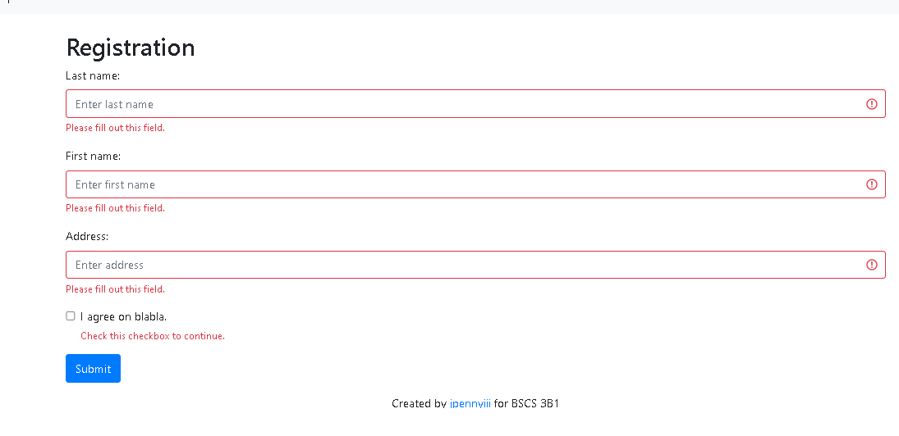
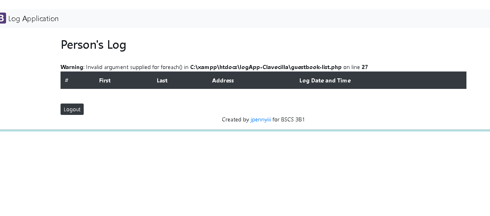

# logApp-scaling-octo

## :christmas_tree:Description 
    A web app that can record a person's Name, and date and time he/she logged into the system. It saves and displays into a list.
___
## :eyes:Visuals 
**Registration Page**

**Person Log Page**

___
## :computer:Installation 
* Install Xampp. Visit this [link](https://www.apachefriends.org/download.html) for xampp installation
*   Run Xampp control panel. Start Apache and mysql
* Access phpmyAdmin(localhost/phpmyadmin) and import the [database](https://www.apachefriends.org/download.html)
* Open config.php from config folder and change the credentials(e.g password) based on your local host credentials.
* Access Index.php

## :tophat:Authors (include photos)
**Jann Penny A. Clavecilla III**
